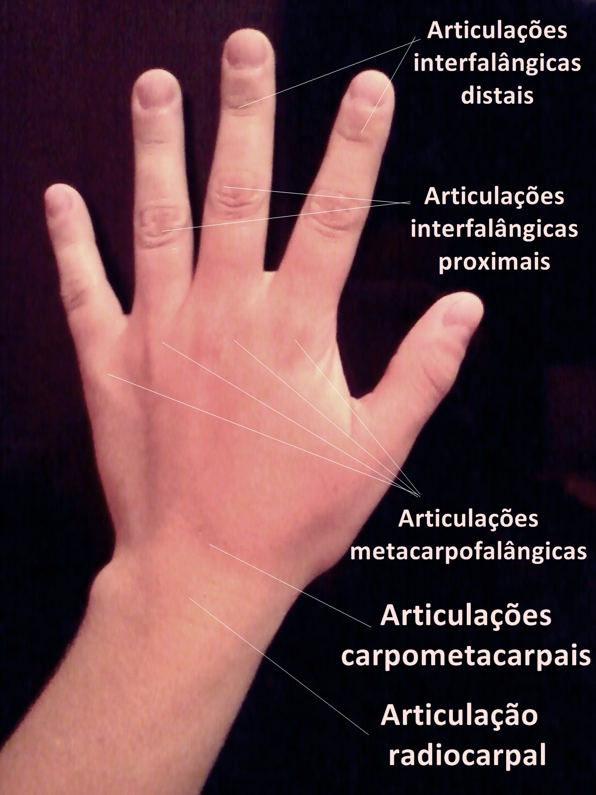

<!-- # [Mirror Hand](index.md) -->

## Uma luva capturadora de movimentos usando sensores óticos de flexão e replicação dos movimentos capturados utilizando mão robótica.

### Integrantes

 - Caíque Destro (1658930) - caiquedestro@gmail.com

 - João Carlos Cardoso dos Santos (1371916) - jc.cardoso4@gmail.com

### Cronograma:

 - [Cronograma](https://docs.google.com/spreadsheets/d/1rPYKbOurIVPeYO_swWk3HFBk6oQO6jvVg92YagprTJc/edit?usp=sharing)
 
### Relatório Final:

 - [Relatório Final](Relat_rio_final___MirrorHand_rev1.pdf)

## O Projeto 

 - [Componentes](componentes.md)
 - [Luva](luvafinal.md)
 - [Mão Mecânica](maomecanicafinal.md)
 - [Software e integração](SoftwareInt.md)
 
## Demonstração

<video src="demonstracao1.webm" controls preload></video>

### Motivação

Soluções de captura de movimentos tradicionais presentes na atualidade consistem em sistemas de alto custo que utilizam grandes espaços requerendo configurações com múltiplas câmeras e trajes especializados. Mais especificamente, dispositivos capazes de capturar movimentos de mãos são oferecidos apenas para mercados e pessoas bem específicas, utilizando sensores e soluções de software proprietários extremamente caros. Alternativamente, novos softwares de reconhecimento de imagens estão sendo desenvolvidos para captura de movimentos porém ainda estão em suas fases iniciais e ainda não apresentam confiabilidade ou resultados satisfatórios.

Captura de movimentos de mãos é algo de importante relevância na sociedade, porém soluções de baixo custo são extremamente escassas. Alguns exemplos de aplicações de tal tecnologia são: jogos e simuladores de realidade virtual na indústria de entretenimento, terapia e estudos dos movimentos das mãos de pacientes na indústria médica, entre outras.
Isso aliado a uma tecnologia de replicação dos movimentos por uma mão robótica pode permitir a quebra de barreiras físicas e de distância, permitindo não só a realização de procedimentos a distância, mas minimizando riscos de contaminação em procedimentos médicos ou de ferimentos em ambientes de alto risco.

### Objetivo geral

O presente projeto se propõe a criar um sistema de captura de movimentos e replicação dos movimentos por uma mão robótica, utilizando componentes e materiais de baixo custo.

### Objetivos específicos

Os objetivos do projeto são:

 - Criação e construção de uma luva capturadora de movimentos das articulações dos dedos e orientação da mão do usuário;
 - Monitoramento e visualização dos dados obtidos em um computador externo utilizando software 3D;
 - Construção de uma mão robótica capaz de replicar os movimentos capturados.

## Conceito

O conceito do projeto consiste na utilização de múltiplos sensores, atuadores e dispositivos que possam se comunicar com o objetivo de se utilizar uma luva que possa registrar os movimentos da mão utilizando sensores de flexão dos dedos, assim como rotação da mão como um todo, e utilizar os dados obtidos para controle de uma mão robótica ou visualização externa. 

A mão humana pode possui 3 articulações principais para flexão dos dedos pra flexão dos dedos. São elas: articulações interfalângicas distais, articulações interfalângicas proximais e articulações metarcapofalângicas (figura 1). As articulações interfalângicas são capazes apenas de movimentos de rotação de até 90 graus em apenas um eixo enquanto a última é capaz de realizar rotações de 90 graus em um eixo e 30 graus em um eixo adicional.

 
<small>Figura 1 - Articulações da mão</small>

Utilizando-se sensores de flexão é possível capturar a quantidade de flexão em cada uma dessas articulações. Com esses dados é possível a visualização dos movimentos em um software 3D em um computador ou a replicação dos movimentos por outros dispositivos, como por exemplo uma mão robótica.

Para comunicação entre os componentes são utilizado variados protocolos de comunicação. Para construção da mão foi envisionado um modelo semelhante ao de tendões presentes na mão humana. Nesse modelo linhas se comportam como tendões sendo puxadas por atuadores responsáveis por flexionar ou extender os dedos. 

## Pré-Projeto
 - [Pré-projeto](preprojeto.md)
 - [Luva(Pré-projeto)](luva.md)
 - [Mão Robótica(Pré-projeto)](maomecanica.md)

### Apresentação pré-projeto:

<iframe src="https://docs.google.com/presentation/d/e/2PACX-1vRffG2Q6gzKz5Kw5BDXvtA4HoA5tJwQld_cZXNodl7iY-V_7_jIz_v5gzBc4bYqyP8XAek6BO6x0ram/embed?start=false&loop=false&delayms=3000" frameborder="0" width="960" height="569" allowfullscreen="true" mozallowfullscreen="true" webkitallowfullscreen="true"></iframe>
