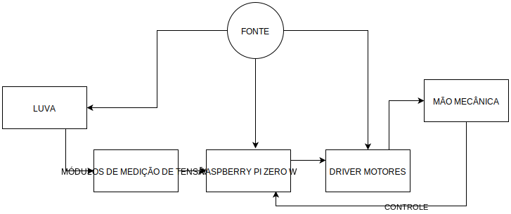

<!-- # [Mirror Hand](index.md) -->

## Uma luva capturadora de movimentos usando sensores óticos de flexão e replicação dos movimentos capturados utilizando mão robótica.

### Integrantes

 - Caíque Destro (1658930) - caiquedestro@gmail.com

 - João Carlos Cardoso dos Santos (1371916) - jc.cardoso4@gmail.com
 
### Apresentação:

<iframe src="https://docs.google.com/presentation/d/e/2PACX-1vRffG2Q6gzKz5Kw5BDXvtA4HoA5tJwQld_cZXNodl7iY-V_7_jIz_v5gzBc4bYqyP8XAek6BO6x0ram/embed?start=false&loop=false&delayms=3000" frameborder="0" width="960" height="569" allowfullscreen="true" mozallowfullscreen="true" webkitallowfullscreen="true"></iframe>

### Cronograma:

 - [Cronograma](https://docs.google.com/spreadsheets/d/1rPYKbOurIVPeYO_swWk3HFBk6oQO6jvVg92YagprTJc/edit?usp=sharing)

### Problema:

  
Hoje em dia existem muitas ferramentas de captura de movimento corporal, umas das aplicações mais comuns são o uso em games e realidade virtual. Porém existe uma possibilidade ainda não tão barata e difundida que é a de reproduzir movimentos humanos em máquinas, o que abre possibilidade para derrubar barreiras físicas. Por exemplo, existem lugares no Brasil, distantes dos grandes centros, onde não é possível encontrar médicos de todas as especialidades, sendo assim, algumas pessoas precisam se deslocar grandes distâncias para encontrar algum profissional da saúde que possa resolver seu problema.

### Escopo em alto nível:

  
O propósito do projeto é possibilitar que os movimentos da mão de uma pessoa possam ser reproduzidos numa espécie de réplica robótica. Sendo assim, o problema apresenta três desafios. O primeiro é encontrar uma maneira de capturar os movimentos da mão do usuário e transformar em dados que possamos trabalhar. O segundo é construir a mão mecânica que replicará os movimentos. O terceiro é desenvolver uma maneira de interfacear os dados obtidos pelos movimentos da mão para a mão mecânica, o que será feito com Raspberry Pi Zero W.
  A intenção aqui é, através de uma luva de dados (ou <i>data glove</i>), replicar os movimentos dos cinco dedos da mão e do punho, porém, apenas o movimento de abrir e fechar individualmente cada dedo, com duas articulações apenas (não será possível reproduzir a saudação vulcana).

### Requisitos:

 - Requisitos da luva:
   * Capturar o movimento das articulações interfalângicas proximais.
   * Capturar o movimento das articulações metacarpofalângicas.
   * Capturar movimento da articulação do punho.
   * Capturar rotação da mão.

 - A luva não será capaz de:
   * Capturar os movimentos laterais das articulações metacarpofalângicas.
   * Capturar os movimentos laterais da articulação do pulso.

 - Requisitos da mão mecânica
   * Flexionar as articulações interfalângicas distais e articulações interfalângicas proximais (as duas juntas, de forma dependente)
   * Flexionar as articulações metacarpofalângicas.
   * Flexionar o punho.
   * Rotacionar o punho.

 - A mão mecânica não será capaz de:
   * Flexionar as articulações metacarpofalângicas lateralmente.
   * Flexionar as articulações interfalângicas distais e interfalângicas de forma independente.
   * Flexionar o pulso lateralmente
   
### Diagrama de Blocos:

### Integração:

- Programação 1 e 2:
  Conhecimento básico de programação para desenvolver o interfaceamento entre a luva e a mão.

- Introdução à Prática de Laboratório, Eletricidade, Circuitos Elétricos/Digitais:
  Trabalhar com circuitos contendo sensores e atuadores.

- Desenho Técnico e Análise e Projeto de Sistemas:
  Elaborar, diagramar e projetar o sistema.

### Análise de Riscos (possibilidade, gravidade):

- Problema: sensores e atuadores defeituosos (5, 1)
  * Solução: comprar novos ali na Beta

- Problema: defeito no Raspberry (3, 3)
  * Solução: comprar novo Raspberry

- Problema: falta de precisão nos sensores construídos (2, 3)
  * Solução: desenvolver algoritmo de tratamento dos dados (já levado em conta no cronograma)

- Problema: um integrante da equipe desistir da matéria (1, 5)
  * Solução: o integrante que sobrar vai ter que trabalhar em dobro

- Problema: dificuldade na construção das articulações da mão
  * Solução: Simplificar o projeto e/ou escolher um novo modelo de construção da mão (já definidos no pré-projeto)
  
### Entregas:

- Entrega 1: Luva de dados

- Entrega 2: Mão robótica

- Entrega 3: Protótipo/Comunicação entre luva e mão robótica

### O Projeto

 - [Luva](luva.md)
 - [Mão Robótica](maomecanica.md)
