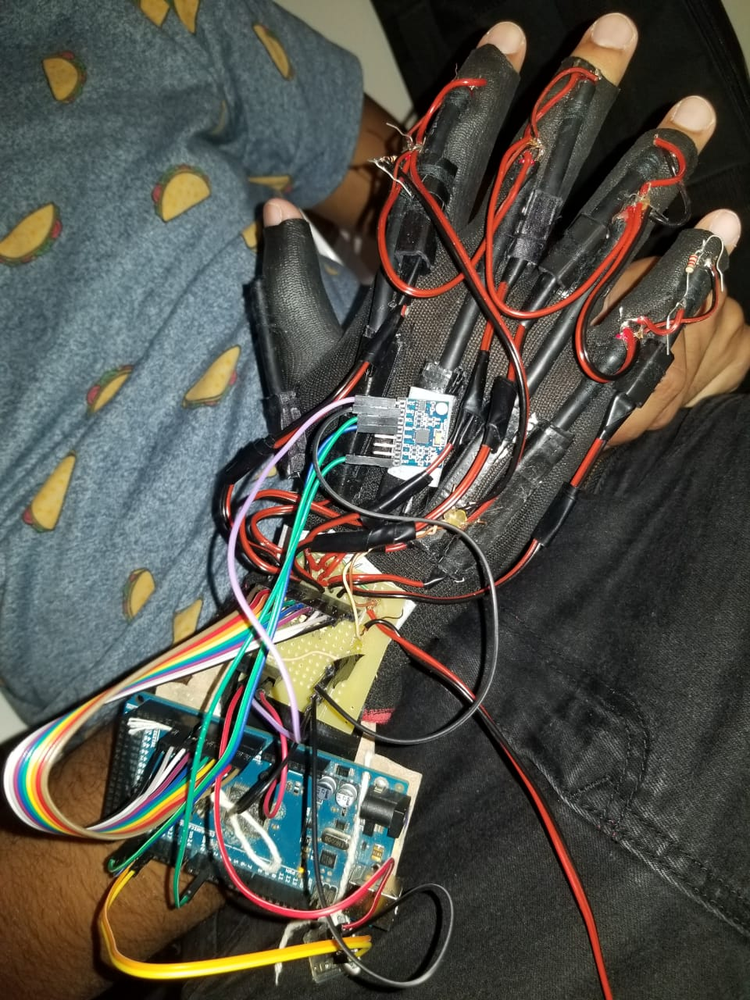

<!-- # [Mirror Hand](luvafinal.md) -->

# A Luva

## Projeto mecânica da luva

Foram construídos os sensores de fibra óptica para cada articulação e posicionados nas articulações interfalângicas proximais utilizando LEDs de baixo brilho e nas articulações metacarpofalângicas utilizando LEDs de alto brilho. As articulações correspondentes podem ser observadas na figura \ref{articulacoesmao}.

Os sensores ópticos de flexão foram costurados a uma luva de couro sintético, uma de sua extremidades ficou fixa na luva enquanto a outra foi deixada solta e foi introduzida em um tubo (também costurado na luva de maneira fixa) para permitir a livre flexão das articulações do usuário. A figura 1 apresenta a luva parcialmente construída.

 
<small>Figura 1 - Luva parcialmente construída</small>

Na parte posterior da luva também se encontra o sensor inercial MPU6050 utilizado para registrar a orientação da luva. No pulso está fixado o Arduino Mega 2560 com o adaptador Bluetooth HC-06. O resultado final pode ser visto na figura 2.

 
<small>Figura 2 - Luva finalizada</small>

## Projeto de hardware da luva

Integrados a luva estão a placa de saída de dados e alimentação da luva assim como um Arduino Mega 2560. A luva é alimentada por uma fonte USBUniversal Serial Bus de 5V.

Cada LDR foi testado de forma individual para aferir o comportamento do valor da resistência ao flexionar cada articulação dos dedos. Isso foi feito de forma a definir os valores de cada resistor utilizado na saída dos sensores ópticos de flexão já que foi necessário a montagem de circuitos divisores de tensão para cada sensor. Os LDR e os resistores definidos foram então soldados em uma placa de cobre onde também estão presente o cabo USB responsável pela alimentação da luva assim como conectores para jumpers fêmea responsáveis pela saída do sinal dos sensores assim como alimentação dos demais componentes do sistema.

A placa Arduino é utilizada como um receptor dos dados analógicos dos sensores e um conversor analógico digital, assim como receptor dos dados do sensor inercial. Por possuir inúmeras entradas e saídas digitais e analógicas assim como várias portas seriais diferentes  essa placa nos deu grande flexibilidade para escolher a maneira de comunicação entre os componentes do projeto. Dessa forma foi desenvolvida a comunicação serial entre os demais componentes com opção para bluetooth utilizando o adaptador HC-06 ou via USB.

A placa de saída de dados consiste em uma placa de cobre onde estão soldados os resistores e as saídas dos valores de tensão dos LDR. Desse jeito foi feita a divisão de tensão reponsável pela saída dos dados dos sensores ópticos de flexão que podem ser conectados ao Arduino. O esquematico da luva com os sensores ópticos de flexão e divisores de tensão podem ser vistos na figura 3.

 
<small>Figura 3 - Esquemático da luva</small>

Cada saída dos divisores de tensão foi ligado a uma porta analógica do Arduino e as saídas do sensor inercial foram ligados às suas respectivas portas I2C. O diagrama final do hardware entre luva e Arduino pode ser visto na figura 4.

 
<small>Figura 4 - Diagrama de blocos do hardware da luva</small>